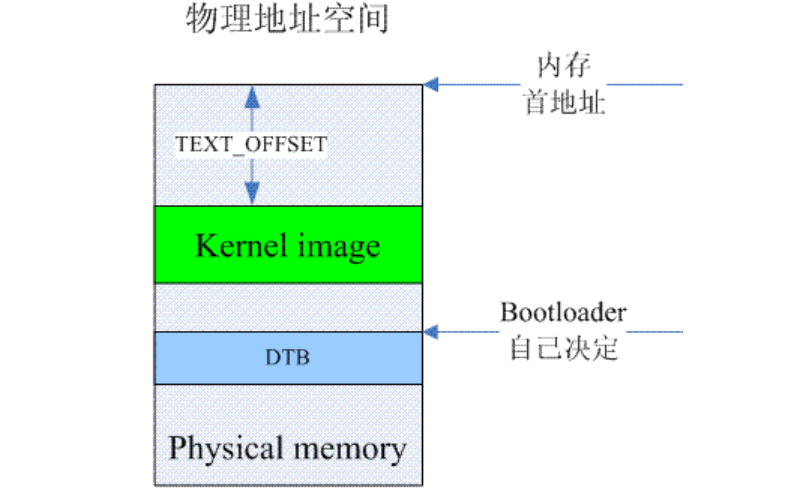

# kernel启动

## 启动之前

ref: http://www.wowotech.net/armv8a_arch/arm64_initialize_1.html

在详细描述linux kernel对内存的初始化过程之前，我们必须首先了解kernel在执行第一条语句之前所面临的处境。这时候的内存状况可以参考下图：



bootloader有自己的方法来了解系统中memory的布局，然后，它会将绿色的kernel image和蓝色dtb image copy到了指定的内存位置上。kernel image最好是位于main memory起始地址偏移TEXT_OFFSET的位置，当然，TEXT_OFFSET需要和kernel协商好。kernel image是否一定位于起始的main memory（memory address最低）呢？也不一定，但是对于kernel而言，低于kernel image的内存，kernel是不会纳入到自己的内存管理系统中的。对于dtb image的位置 linux并没有特别的要求。由于这时候MMU是turn off的，因此CPU只能看到物理地址空间。对于cache的要求也比较简单，只有一条：kernel image对应的cache必须clean to PoC，即系统中所有的observer在访问kernel image对应内存地址的时候是一致性的。

## 进入kernel之前

系统启动过程中，linux kernel不是一个人在战斗，在kernel之前bootloader会执行若干的动作，然后把控制权转移给linux kernel。需要特别说明的是：这里bootloader是一个宽泛的概念，其实就是为kernel准备好执行环境的那些软件，可能是传统意义的bootloader（例如Uboot），也可能是Hypervisor或者是secure monitor。具体bootloader需要执行的动作包括：

1、初始化系统中的RAM并将RAM的信息告知kernel

2、准备好device tree blob的信息并将dtb的首地址告知kernel

3、解压内核（可选）

4、将控制权转交给内核。当然，bootloader和kernel的交互的时候需求如下：

> MMU = off, D-cache = off, I-cache = on or off
>   x0 = physical address to the FDT blob

这里需要对data cache和instruction cache多说几句。我们知道，具体实现中的ARMv8处理器的cache是形成若干个level，一般而言，可能L1是分成了data cache和instruction cache，而其他level的cache都是unified cache。上面定义的D-cache off并不是说仅仅disable L1的data cache，实际上是disable了各个level的data cache和unified cache。同理，对于instruction cache亦然。

此外，在on/off控制上，MMU和data cache是有一定关联的。在ARM64中，SCTLR, System Control Register用来控制MMU icache和dcache，虽然这几个控制bit是分开的，但是并不意味着MMU、data cache、instruction cache的on/off控制是彼此独立的。一般而言，这里MMU和data cache是绑定的，即如果MMU 是off的，那么data cache也必须要off。因为如果打开data cache，那么要设定memory type、sharebility attribute、cachebility attribute等，而这些信息是保存在页表（Translation table）的描述符中，因此，如果不打开MMU，如果没有页表翻译过程，那么根本不知道怎么来应用data cache。当然，是不是说HW根本不允许这样设定呢？也不是了，**在MMU OFF而data cache是ON的时候，这时候，所有的memory type和attribute是固定的，即memory type都是normal Non-shareable的，对于inner cache和outer cache，其策略都是Write-Back，Read-Write Allocate的。**

## 链接文件

首先看链接文件如下:

```c
ENTRY(_text)
SECTIONS
{
	/* .....省略部分无关内容.... */
	. = KIMAGE_VADDR;

	.head.text : {
		_text = .;
		HEAD_TEXT
	}
}
```

可以看到入口点在`_text`. 而`_text`是指向`.head.text`段的起始位置. 所以内核是从`.head.text`开始运行的. 那么这个段是写什么内容呢? HEAD_TEXT是一个宏

```c
#define HEAD_TEXT *(.head.text)
```

## head.S执行前

bootloader在跳转到kernel前，需要确保如下设置：

```c
 /* 
  * MMU = off, D-cache = off, I-cache = on or off,                                                           
  * x0 = physical address to the FDT blob. 
  */
```

那么就有几个问题值得思考：

- **为何要保持MMU关闭？** 因为此时还没有创建页表
- **为何要关闭D-cache?**  因为D-cache中可能存在bootloader中带过来的数据，对于kernel阶段是无效的，因此要关闭D-cache.
- **为何I-cache可以开？** 因为bootloader与kernel位于不同的内存区间，不可能映射到I-cache的同一个set

## head.S入口函数

在`arch/arm64/kernel/head.S`中有

```c
	__HEAD
_head:
	/*
	 * DO NOT MODIFY. Image header expected by Linux boot-loaders.
	 */
#ifdef CONFIG_EFI
	/*
	 * This add instruction has no meaningful effect except that
	 * its opcode forms the magic "MZ" signature required by UEFI.
	 */
	add	x13, x18, #0x16
	b	primary_entry
#else
	b	primary_entry 		// branch to kernel start, magic
	.long	0				// reserved
#endif
	...省略后面的内容...
```

所以对应到code, 内核是从`_head`开始运行的. 这个开始点放置了一个arm64 linux的header:

```c
u32 code0;			    /* Executable code */
u32 code1;			    /* Executable code */
u64 text_offset;		/* Image load offset, little endian */
u64 image_size;		    /* Effective Image size, little endian */
u64 flags;			    /* kernel flags, little endian */
u64 res2	= 0;		/* reserved */
u64 res3	= 0;		/* reserved */
u64 res4	= 0;		/* reserved */
u32 magic	= 0x644d5241;	/* Magic number, little endian, "ARM\x64" */
u32 res5;			        /* reserved (used for PE COFF offset) */
```

这个头的前两个位置放置的是可执行code，

在开启UEFI支持时, `add x13, x18, #0x16`这个code实际上是为了满足EFI格式的”MZ”头. 如果使用UEFI来启动kernel, 会识别出来并走UEFI启动的流程,__EFI_PE_HEADER里面有个entrypoint；

 如果是普通的启动过程如使用uboot的booti进行引导, 那么第一条指令就是一条dummy指令. 第二条就跳转到`primary_entry`运行了.

```c
SYM_CODE_START(primary_entry)
	bl	preserve_boot_args
	bl	el2_setup			            // Drop to EL1, w0=cpu_boot_mode
	adrp	x23, __PHYS_OFFSET
	and	x23, x23, MIN_KIMG_ALIGN - 1	// KASLR offset, defaults to 0
	bl	set_cpu_boot_mode_flag
	bl	__create_page_tables
	/*
	 * The following calls CPU setup code, see arch/arm64/mm/proc.S for
	 * details.
	 * On return, the CPU will be ready for the MMU to be turned on and
	 * the TCR will have been set.
	 */
	bl	__cpu_setup			// initialise processor
	b	__primary_switch
SYM_CODE_END(primary_entry)
```

这段代码就是内核启动是运行的初始化代码. 后面会分章节来详细描述.

## 保存启动信息

先来看看`bl preserve_boot_args`, preserve_boot_args 主要是用来保存从 bootloader 传递的参数，使 dcache 失效。由于MMU = off, D-cache = off，因此写入boot_args变量的操作都是略过data cache的，直接写入了RAM中（这里的D-cache并不是特指L1的data cache，而是各个level的data cache和unified cache），为了安全起见（也许bootloader中打开了D-cache并操作了boot_args这段memory，从而在各个level的data cache和unified cache有了一些旧的，没有意义的数据），需要将boot_args变量对应的cache line进行清除并设置无效。

```c
preserve_boot_args:
	mov	x21, x0				        // 将dtb的地址暂存在x21寄存器中，释放出x0以便后续做临时变量使用

	adr_l	x0, boot_args			// x0保存了boot_args变量的地址
	stp	x21, x1, [x0]			    // 保存x21和x1的值到boot_args[0]和boot_args[1]
	stp	x2, x3, [x0, #16]			// 保存x2和x3的值到boot_args[2]和boot_args[3]

	dmb	sy				// needed before dc ivac with
						// MMU off

	mov	x1, #0x20			    // 4 x 8 bytes， x0和x1是传递给__inval_cache_range的参数
	b	__inval_dcache_area		// tail call
ENDPROC(preserve_boot_args)
```

代码的含义一目了然, 把存 fdt 内存地址的x0保存到x21寄存器. 然后把启动参数x0, x1, x2, x3全部保存到boot_args数组中.

arm64 linux规定:

> Primary CPU general-purpose register settings

> x0 = physical address of device tree blob (dtb) in system RAM.

> x1 = 0 (reserved for future use)

> x2 = 0 (reserved for future use)

> x3 = 0 (reserved for future use)

这里值得注意的有几点

1. 如何访问boot_args这个符号的呢？这个符号是一个虚拟地址，但是现在没有建立好页表，也没有打开MMU，如何访问它呢？这是通过adr_l这个宏来完成的。这个宏实际上是通过adrp这个汇编指令完成，通过该指令可以**将符号地址变成运行时地址**（通过PC relative offset形式），因此，当运行的MMU OFF mode下，通过adrp指令可以获取符号的物理地址。不过adrp是page对齐的（adrp中的p就是page的意思），boot_args这个符号当然不会是page size对齐的，因此不能直接使用adrp，而是使用adr_l这个宏进行处理。

```c
	.macro	adr_l, dst, sym
#ifndef MODULE
	adrp	\dst, \sym
	add	\dst, \dst, :lo12:\sym  // 表示低12位
#else
	movz	\dst, #:abs_g3:\sym
	movk	\dst, #:abs_g2_nc:\sym
	movk	\dst, #:abs_g1_nc:\sym
	movk	\dst, #:abs_g0_nc:\sym
#endif
	.endm
```

可以看到, 这里的`adr_l`拆分成了两条指令, adrp + add, adrp指令最大寻址空间是+-4GB, 但是所寻址的地址是4KB对齐的. 所以这里在加了一个add指令来修正地址的低12bit, 从而实现了这个加载+-4GB任意位置的运行时地址的宏.

adrp指令详见onenote笔记指令-ldr与adr章节. 

adrp指令可参考 https://blog.csdn.net/u011037593/article/details/121877496

2. 解释一下dmb   sy这一条指令。在ARM ARM文档中，有关于数据访问指令和 data cache指令之间操作顺序的约定，原文如下：

   > All data cache instructions, other than DC ZVA, that specify an address can execute in any order relative to loads or stores that access any address with the Device memory attribute,or with Normal memory with Inner Non-cacheable attribute unless a DMB or DSB is executed between the instructions.

因此，在Non-cacheable的情况下，必须要使用DMB来保证stp指令在dc ivac指令之前执行完成。

3. `__inval_dcache_area`函数用来invalidate指定区域的dcache, 具体如下

```c
ENTRY(__inval_dcache_area)
/* FALLTHROUGH */
/*
 *	__dma_inv_area(start, size)
 *	- start   - virtual start address of region
 *	- size    - size in question
 */
__dma_inv_area:
	add	x1, x1, x0
	dcache_line_size x2, x3
	sub	x3, x2, #1
	tst	x1, x3				// end cache line aligned?
	bic	x1, x1, x3
	b.eq	1f
	dc	civac, x1			// clean & invalidate D / U line 
1:	tst	x0, x3				// start cache line aligned?
	bic	x0, x0, x3
	b.eq	2f
	dc	civac, x0			// clean & invalidate D / U line
	b	3f
2:	dc	ivac, x0			// invalidate D / U line
3:	add	x0, x0, x2
	cmp	x0, x1
	b.lo	2b
	dsb	sy
	ret
ENDPIPROC(__inval_dcache_area)
```

如果boot_args所在区域的首地址和尾部地址没有对齐到cache line怎么办？具体invalidate cache需要操作到那些level的的cache？

可以看到刷的是data cache和L2 cache。另外如果指定内存区域有跨越cacheline, 那么对两边跨越了cacheline的地址使用的clean + invalidate, 对于中间区域可以直接invalidate不用写回内存, 从而加快invalidate速度。

至于详细的clean和invalidate的区别可以参考https://zhuanlan.zhihu.com/p/515450647

tips: 对于Arm v8处理器，L1 cache是指令与数据分离的，L2 cache是unified cache

## 设置core的启动状态

接下来看`el2_setup`

```c
ENTRY(el2_setup)
	msr	SPsel, #1			        // We want to use SP_EL{1,2}
	mrs	x0, CurrentEL 				
	cmp	x0, #CurrentEL_EL2			// 判断是否处于EL2
	b.eq	1f						// 是处于el2的话，就跳到1f
    mov_q   x0, (SCTLR_EL1_RES1 | ENDIAN_SET_EL1) 
	msr	sctlr_el1, x0
	mov	w0, #BOOT_CPU_MODE_EL1		// w0寄存器保存了cpu启动时候的Eexception level
    /* 
     * 由于修改了system control register（设定endianess状态），
     * 因此需要一个isb来同步（具体包括两部分的内容，一是确认硬件已经
     * 执行完毕了isb之前的所有指令，包括修改system control寄存器的
     * 那一条指令，另外一点是确保isb之后的指令重新来过，例如取指，校验权限等）
     */
	isb 
	ret

1:	mrs	x0, sctlr_el2
......省略......
```

判断当前core的EL, 如果是EL1, 先设置大小端，之后就返回`BOOT_CPU_MODE_EL1`, 如果EL2, 会初始化虚拟化相关的东西, 比较复杂, 先搁着。

完成了el2_setup这个函数分析之后，我们再回头思考这样的问题：为何是el2_setup？为了没有el3_setup？当一个SOC的实现在包括了EL3的支持，那么CPU CORE缺省应该进入EL3状态，为何这里只是判断EL2还是EL1，从而执行不同的流程，如果是EL3状态，代码不就有问题了吗？实际上，即便是由于SOC支持TrustZone而导致cpu core上电后进入EL3，这时候，接管cpu控制的一定不是linux kernel（至少目前来看linux kernel不会做Secure monitor），而是Secure Platform Firmware（也就是传说中的secure monitor），它会进行硬件平台的初始化，loading trusted OS等等，等到完成了secure world的构建之后，把控制权转交给non-secure world，这时候，CPU core多半处于EL2（如果支持虚拟化）或者EL1（不支持虚拟化）。因此，对于linux kernel而言，它感知不到secure world（linux kernel一般也不会做Trusted OS），仅仅是在non-secure world中呼风唤雨，可以是Hypervisor或者rich OS。

## 获取地址随机化偏移

```c
adrp	x23, __PHYS_OFFSET
and	x23, x23, MIN_KIMG_ALIGN - 1	// KASLR offset, defaults to 0
```

这段code跟kaslr有关, 我们回头来着重讲这个. 

## set_cpu_boot_mode_flag

先接着往下看`set_cpu_boot_mode_flag`:

在进入这个函数的时候，有一个前提条件：w0寄存器保存了cpu启动时候的Eexception level ，具体代码如下

```c
set_cpu_boot_mode_flag:
	adr_l	x1, __boot_cpu_mode
	cmp	w0, #BOOT_CPU_MODE_EL2
	b.ne	1f
	add	x1, x1, #4
1:	str	w0, [x1]			// This CPU has booted in EL1
	dmb	sy
	dc	ivac, x1			// Invalidate potentially stale cache line
	ret
ENDPROC(set_cpu_boot_mode_flag)
```

由于系统启动之后仍然需要了解cpu启动时候的Eexception level（例如判断是否启用hyp mode），因此，有一个全局变量__boot_cpu_mode用来保存启动时候的CPU mode。这个`__boot_cpu_mode`标签下保存了两个值

```c
ENTRY(__boot_cpu_mode)
	.long	BOOT_CPU_MODE_EL2
	.long	BOOT_CPU_MODE_EL1
```

这段code的作用就是把保存的这两个值修改为一致, 且为当前CORE的启动EL, 其他CORE启动时也会运行这段code, 这样如果后面的CORE启动到了不同的EL就又会把这两个值修改为不一致, 从而可以判断出CPU的启动状态是不对的.

CPU的启动模式在el2_setup时保存到了w0中，此处将启动模式保存到__boot_cpu_mode中，如果启动模式为EL1则保存到__boot_cpu_mode[0],如果启动模式为EL2，则保存到__boot_cpu_mode[1]。

